# PIPA

PIPA (Progressive & Intelligent Performance Analytics) is a platform that aggregates a complete toolchain of performance data collection, processing, and analysis with advanced algorithms, enabling users to effortlessly obtain in - depth insights into the performance of their systems and applications. It bridges the gap between raw performance data and actionable information, allowing for quick identification of bottlenecks and optimization opportunities.


<div align="center">
    
</div>

PIPA (枇杷, loquat) is a local fruit of Zhejiang, China.
PIPA consists of three parts: loquat tree, flower and fruit, which represent the collecting & processing, analysis and conclusion of performance data respectively.

PIPA is still in the active development process, and the current development focus is on the loquat tree.


[](https://github.com/psf/black)
[](https://coveralls.io/github/ZJU-SPAIL/pipa?branch=main)


## Features

- **Data Collecting**: PIPA can collect data from a variety of sources, using tools like perf, sar, and more. It supports multiple platforms including x86_64, ARM, and RISC-V, making it versatile and adaptable. Currently PIPA is capable of collecting and parsing perf and sar data, providing detailed performance metrics.
- **pipa-tree Collector**: A specialized two-phase performance data collection tool:
  - **Counting Phase**: Uses `perf stat` and `sar` to gather system-wide metrics at configurable intervals
  - **Profiling Phase**: Uses `perf record` with DWARF call-graph for detailed function-level profiling
  - **Cross-Platform**: Automatically adapts event groups based on CPU architecture (x86_64/ARM/RISC-V)
  - **Automated Packaging**: Generates standard `.tar.gz` archives with metadata and machine identifiers
- **MCP Service**: Provides Model Context Protocol (MCP) server for flamegraph analysis tools, enabling programmatic stack trace inspection, symbol overhead calculation, and subset analysis via HTTP transport.
- **Script Generation**: To reduce the noise generated by the Python runtime, PIPA can generate scripts that collect performance data.
- **Data Processing**: PIPA can process the collected performance data, including alignment and segmentation, to serve meaningful analysis.
- **Data Visualization**: PIPA can visualize based on the performance data collected to provide intuitive insights.
- **Data Analytics**: PIPA will integrate SPAIL's performance methodology and models to provide meaningful analysis and reveal software and hardware bottlenecks.

```mermaid
sequenceDiagram
    participant User as 👤 User/External System
    participant Fruit as 🍎 PIPA Fruit<br/>📊 Insights & Visualization
    participant Flower as 🌸 PIPA Flower<br/>🔍 Analysis & Attribution
    participant Tree as 🌳 PIPA Tree<br/>📥 Data Collection & QC
    participant Source as 🔌 Data Sources<br/>(perf, sar, eBPF...)

    Note over User, Source: 🚀 Main Data Flow: From Collection to Insights
    User->>Fruit: 📨 Submit performance analysis request
    activate Fruit
    Fruit->>Flower: 📋 Forward analysis requirements
    activate Flower

    Flower->>Tree: 📊 Request performance data
    activate Tree
    Tree->>Source: 🔍 Collect multi-source performance data
    activate Source
    Source-->>Tree: 📄 Return raw data
    deactivate Source

    Note over Tree: 🛡️ Execute Data Quality Control<br/>- ✅ Validation rules<br/>- 🧹 Auto-cleansing & tagging<br/>- 💻 Platform abstraction (x86/ARM/RISC-V)
    Tree-->>Flower: ✅ Return validated, reliable data
    deactivate Tree

    Note over Flower: 🔬 Perform Deep Analysis & Attribution<br/>- 📈 System-level workload characterization analysis<br/>- 🔥 Code-level profiling (hotspot/lock)<br/>- ⚙️ Instruction-level tracing<br/>- 🔗 Cross-layer correlation & attribution
    Flower-->>Fruit: 📊 Return bottleneck analysis results &<br/>🔍 root cause insights
    deactivate Flower

    Note over Fruit: 💡 Generate Actionable Insights<br/>- 📈 Interactive dashboards<br/>- 💡 Optimization opportunities<br/>- ✅ Actionable recommendations
    Fruit-->>User: 📋 Deliver visualization report &<br/>💡 suggestions
    deactivate Fruit

    Note over Flower, Tree: 🔄 Feedback Loop: Continuous Optimization
    Flower->>Tree: 💬 Provide data quality feedback &<br/>📋 new requirements
    activate Tree
    Tree-->>Flower: ✅ Confirm & adjust collection strategy
    deactivate Tree
```



## Installation

PIPA can be easily installed using pip:

```sh
pip install PyPIPA
```


## Quickstart

### Installation

#### Option 1: Python Package Installation

```sh
pip install PyPIPA
```

#### Option 2: pipa-tree Collector

```bash
git clone https://github.com/ZJU-SPAIL/pipa.git
cd pipa/script/pipa-tree
sudo ./install.sh              # Install to /usr/local/bin
sudo ./install.sh --all-users  # Optional: configure sudo for perf (recommended for multi-user environments)
```

For detailed installation instructions, see [pipa-tree Installation Guide](script/pipa-tree/INSTALL.md).

### Using pipa-tree

The pipa-tree collector provides a simple interface to gather performance metrics:

```bash
# Basic usage (default: 60s counting + 60s profiling)
pipa-tree collect

# Custom durations
pipa-tree collect --duration-stat 90 --duration-record 30

# Specify output file
pipa-tree collect --output ./mydata.tar.gz

# Advanced options
pipa-tree collect \
  --perf-record-freq 199 \
  --perf-events "cycles,instructions" \
  --output ./pipa-collection-demo.tar.gz
```

**Output**: A `.tar.gz` archive containing:
- `spec_info.yaml` - Hardware specifications
- `attach_session/pipatree.log` - Detailed collection logs
- `attach_session/perf_stat.txt` - Counting phase metrics
- `attach_session/perf.data` - Profiling data
- `attach_session/sar_*.csv` - System activity reports

### Using PIPA CLI

To generate a script that collects performance data:

```sh
pipa generate
```

Then you can complete the interaction through the CLI to provide the necessary parameters. You can choose to start the workload with perf, or you can choose to observe the system directly.

### Analyzing Collected Data

After collecting data with pipa-tree, analyze it with the PIPA CLI:

```bash
make  # Build and install pipa
pipa analyze ./pipa-collection-demo.tar.gz \
  --expected-cpus 0-7 \
  --symfs /path/to/symbols \
  --kallsyms /proc/kallsyms
```

This generates a `report.html` with CPU clustering, NUMA load, disk warnings, and hot spots.

### MCP Service

Start the MCP server for flamegraph analysis:

```bash
PYTHONPATH=src python -m pipa.service.mcp --host 0.0.0.0 --port 8000 --path /mcp
```

For detailed MCP tool usage and examples, see [MCP Service Guide](doc/mcp.md).

### Documentation

- **Quick Start Guide**: [doc/quick-start.md](doc/quick-start.md)
- **Development Guidelines**: [doc/development.md](doc/development.md)
- **MCP Service**: [doc/mcp.md](doc/mcp.md)

PIPA's API documentation is available at [https://zju-spail.github.io/pipa/](https://zju-spail.github.io/pipa/).

## Build

To build PIPA, you can use the `python` command with the `build` module:  `python -m build`, we use `hatchling` as the build backend.

## LICENSE

PIPA is distributed under the terms of the [MIT License](LICENSE).


## Contributing

Contributions to PIPA are always welcome. Whether it's feature enhancements, bug fixes, or documentation, your contributions are greatly appreciated.
