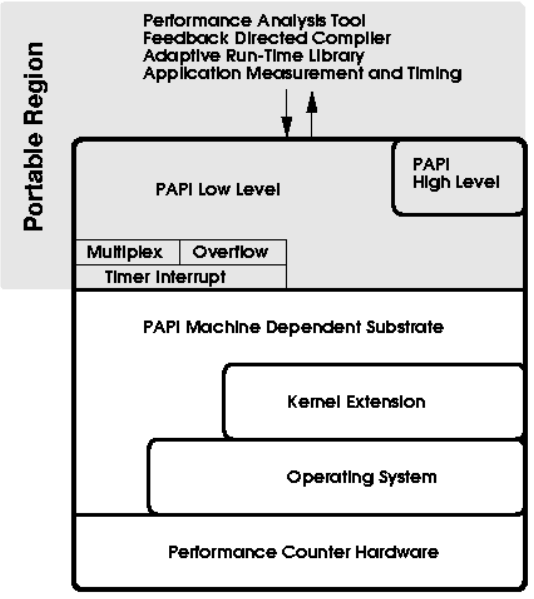

# Performance Analysis Tools: PIPA and PAPI

## Table of Contents

1. [Introduction](#introduction)
2. [PAPI (Performance Application Programming Interface)](#papi-performance-application-programming-interface)
    - [Architecture of PAPI](#architecture-of-papi)
        - [Architecture Layers](#architecture-layers)
    - [PAPI Interfaces](#papi-interfaces)
        - [C and Fortran Calling Interfaces](#c-and-fortran-calling-interfaces)
    - [PAPI Components](#papi-components)
        - [Component Types](#component-types)
    - [Installing Components](#installing-components)
    - [Example Code for PAPI](#example-code-for-papi)
    - [Steps to Use PAPI](#steps-to-use-papi)
3. [PIPA (Platform Integrated Performance Analytics)](#pipa-platform-integrated-performance-analytics)
    - [Key Features of PIPA](#key-features-of-pipa)
        - [Data Collecting](#data-collecting)
        - [Script Generation](#script-generation)
        - [Data Processing](#data-processing)
        - [Data Visualization](#data-visualization)
        - [Data Analytics](#data-analytics)
    - [Installation of PIPA](#installation-of-pipa)
    - [Quickstart with PIPA](#quickstart-with-pipa)
    - [Example Code for PIPA](#example-code-for-pipa)
4. [Conclusion](#conclusion)

## Introduction

First of all, let us clarify that this document is not a UDP joke. PIPA (Platform Integrated Performance Analytics) and PAPI (Performance Application Programming Interface) are indeed two different tools. Both PIPA and PAPI are performance analysis tools, but their design goals and functionalities differ. In this document, we will provide a detailed introduction and comparison of these two tools to help readers better understand their characteristics and application scenarios.

## PAPI (Performance Application Programming Interface)

PAPI is a tool that provides a consistent interface and methodology for tool designers and application engineers to use low-level performance counter hardware found across the entire compute system, including CPUs, GPUs, on/off-chip memory, interconnects, I/O systems, and energy/power components. PAPI enables users to see, in near real-time, the relationships between software performance and hardware events across the entire computer system.

### Architecture of PAPI

The architecture of PAPI is illustrated in the following diagram:



#### Architecture Layers

1. **Performance Counter Hardware**
   - This is the lowest layer and consists of various hardware performance counters, such as CPU counters and cache counters. These counters record hardware events such as clock cycles, instructions executed, cache hits and misses, etc.

2. **Operating System**
   - The operating system provides the foundation for upper-layer components to access hardware performance counters. It manages hardware resources and interacts with the hardware through system calls and drivers.

3. **Kernel Extension**
   - Kernel extensions provide additional functionality to the operating system, enabling it to support access to hardware performance counters. They configure and manage the use of performance counters and provide interfaces for upper-layer software.

4. **PAPI Machine Dependent Substrate**
   - This layer handles the interface with specific hardware platforms. Due to the different implementations of performance counters on various hardware platforms, this layer ensures the portability of PAPI. It provides a unified access mechanism for the upper-layer PAPI interface, with different hardware platforms requiring corresponding substrate implementations.

5. **PAPI Low Level**
   - This layer provides low-level access to hardware performance counters. It allows users to directly configure and read performance counters, handling multiplexing, overflow, and other scenarios.
     - **Multiplex**: Allows multiple performance counters to share a single hardware counter by rotating through them in time slices.
     - **Overflow**: Triggers an interrupt or callback when a performance counter reaches its maximum value, handling counter overflow events.
     - **Timer Interrupt**: Uses a timer interrupt mechanism to sample performance counter data, useful for analyzing time-series data.

6. **PAPI High Level**
   - The high-level interface provides a more abstract and user-friendly API, allowing users to use performance counters for performance analysis more easily. It abstracts away the complexity of the low-level interface, offering a set of predefined, high-level hardware events for quick usage.

7. **Portable Region**
   - This is the part of the PAPI architecture that is independent of the hardware platform. It includes various high-level performance analysis tools, feedback-directed compilers, adaptive runtime libraries, and application measurement and timing tools. Through this layer, PAPI achieves cross-platform performance monitoring capabilities.

### PAPI Interfaces

#### C and Fortran Calling Interfaces

PAPI is written in C. The function calls in the C interface are defined in the header file `papi.h` and have the following form:

```c
<returned data type> PAPI_function_name(arg1, arg2, …)
```

The function calls in the Fortran interface are defined in the source file `papi_fwrappers.c` and have the following form:

```fortran
PAPIF_function_name(arg1, arg2, …, check)
```

As you can see, C function calls have corresponding Fortran function calls (PAPI_<call> becomes PAPIF_<call>). This is generally true for most function calls, except for functions that return C pointers to structures, such as PAPI_get_opt and PAPI_get_executable_info, which are either not implemented in the Fortran interface or implemented with different calling semantics. In the Fortran interface function calls, the return code of the corresponding C routine is returned in the argument `check`.

For most architectures, the following relation holds between the pseudo-types listed and Fortran variable types:

| Pseudo-type      | Fortran type                      | Description                          |
|------------------|-----------------------------------|--------------------------------------|
| C_INT            | INTEGER                           | Default integer type                 |
| C_FLOAT          | REAL                              | Default real type                    |
| C_LONG_LONG      | INTEGER*8                         | Extended size integer                |
| C_STRING         | CHARACTER*(PAPI_MAX_STR_LEN)      | Fortran string                       |
| C_INT FUNCTION   | EXTERNAL INTEGER FUNCTION         | Fortran function returning integer   |

Array arguments must be of sufficient size to hold the input/output from/to the subroutine for predictable behavior. The array length is indicated either by the accompanying argument or by internal PAPI definitions.

Subroutines accepting `C_STRING` as an argument are on most implementations capable of reading the character string length as provided by Fortran. In these implementations, the string is truncated or space-padded as necessary. For other implementations, the length of the character array is assumed to be of sufficient size. No character string longer than `PAPI_MAX_STR_LEN` is returned by the PAPIF interface.

### PAPI Components

PAPI provides several components that allow you to monitor system information of CPUs, network cards, graphics accelerator cards, parallel file systems, and more. While the CPU components `perf_event` and `perf_event_uncore`, and the `sysdetect` component are enabled by default, all other components have to be specified during the installation process.

#### Component Types

In PAPI, there are two types of components:

1. **Standard Components**: Fully initialized after a call to `PAPI_library_init` (e.g., `perf_event` and `perf_event_uncore`).
2. **Delay Init Components**: Fully initialized after a call to any of the PAPI functions that access the component, like `PAPI_enum_cmp_event` or `PAPI_add_event` (e.g., `cuda` and `rocm`).

After calling `PAPI_library_init`, Delay Init components are in an intermediate initialization state. This is conveyed to the user by setting the disabled flag of the component info structure to `PAPI_EDELAY_INIT`. If the user does not need to access the component info structure, the user does not need to be concerned with delayed initialization. Delay Init components' initialization is completed by, e.g., a call to `PAPI_enum_cmp_event`. If the call returns `PAPI_OK`, the component disabled flag is updated from `PAPI_EDELAY_INIT` to `PAPI_OK`.

The reason PAPI has Delay Init components is to minimize overhead. Some components, like GPU components, may have hundreds of thousands of events that require several minutes to be accessed. If a component with hundreds of thousands of events is configured in PAPI but the user does not need it, it would be unreasonable for the user to wait several minutes for the component to be initialized.

### Installing Components

To install PAPI with additional components, you have to specify them during configuration.

For example, to install PAPI with the CUDA component enabled:

```bash
./configure --with-components="cuda"
```

If you want to install multiple components, you must specify them as a space-separated list.

Example:

```bash
./configure --with-components="appio coretemp cuda nvml"
```

### Example Code for PAPI

Throughout this overview, there are a number of blocks of example code. It is our intention that this code will be executable by simply copying it into a file, compiling it, and linking it to the PAPI library. Many code blocks will reference an error handling function called `handle_error()`. The version of `handle_error()` that is implemented in example code blocks can be seen below:

```c
#include <papi.h> 
#include <stdio.h>
#include <stdlib.h>

void handle_error (int retval)
{
     printf("PAPI error %d: %s\n", retval, PAPI_strerror

(retval));
     exit(1);
}
```

As a note, you can create your own `handle_error()` function if you would like. Another variation of `handle_error()` can be seen in the section titled Handling Errors of PAPI Error Handling.

To compile an example code block, use a command such as the one below:

```bash
gcc -I. example.c libpapi.a -o example
```

If you encounter example code that will not compile and run, please let us know. Keeping our examples up to date is an ongoing process.

### Steps to Use PAPI

1. **Download and Install PAPI**
   - Clone the PAPI repository using Git and ensure your local copy is up to date:
     ```bash
     git clone https://github.com/icl-utk-edu/papi.git
     cd papi
     git pull https://github.com/icl-utk-edu/papi.git
     ```

   - Install required components and build the PAPI libraries as per the instructions in `INSTALL.txt`:
     ```bash
     cd papi/src
     ./configure --prefix=$PWD/install
     make && make install
     ```

2. **Run `papi_avail` to Check Installation**
   - Verify that PAPI is installed correctly:
     ```bash
     cd install/bin
     ./papi_avail
     ```

3. **Run the Test Suite**
   - Run some tests in the `papi/src/ctests` directory:
     ```bash
     cd papi/src/ctests
     ./serial_hl 
     ```

4. **Set Environment Variables**
   - Set the following environment variables before running your own code:
     ```bash
     export PAPI_DIR=<location where PAPI is installed>
     export PATH=${PAPI_DIR}/bin:$PATH
     export LD_LIBRARY_PATH=${PAPI_DIR}/lib:$LD_LIBRARY_PATH
     ```

5. **Instrument Your Code with PAPI**
   - Refer to the PAPI Counter Interfaces and integrate PAPI into your code.

6. **Compile and Run Your Code**
   - Ensure the correct path to the PAPI header and library is specified in your Makefile:
     ```bash
     gcc your_hello_world.c -I/${PAPI_DIR}/include -L/${PAPI_DIR}/lib -o your_hello_world -lpapi
     ./your_hello_world
     ```

## PIPA (Platform Integrated Performance Analytics)

PIPA is a comprehensive performance analysis tool designed to collect, process, analyze, and visualize performance data from various sources. Unlike PAPI, which focuses on low-level hardware performance counters, PIPA aims to provide a broader and more integrated approach to performance analytics, making it versatile and adaptable to different platforms and environments.

### Key Features of PIPA

#### Data Collecting

PIPA can collect data from a variety of sources using tools like `perf`, `sar`, and more. It supports multiple platforms, including x86_64, ARM, and RISC-V, making it highly versatile and adaptable. Currently, PIPA is capable of collecting and parsing `perf` and `sar` data, providing detailed performance metrics.

#### Script Generation

To reduce the noise generated by the Python runtime, PIPA can generate scripts that collect performance data. This allows for more accurate and efficient data collection without the overhead of running a Python interpreter.

#### Data Processing

PIPA processes the collected performance data, including alignment and segmentation, to provide meaningful analysis. It ensures that the data is correctly formatted and organized for further analysis.

#### Data Visualization

PIPA can visualize performance data to provide intuitive insights. This helps users understand the performance characteristics of their applications through various graphical representations, making it easier to identify performance bottlenecks and areas for improvement.

#### Data Analytics

PIPA integrates SPAIL's performance methodology and models to provide meaningful analysis and reveal software and hardware bottlenecks. This advanced analytical capability helps users to perform in-depth performance analysis and optimization.

### Installation of PIPA

PIPA can be easily installed using pip:

```bash
pip install PyPIPA
```

### Quickstart with PIPA

After installation, you can start using PIPA to collect, integrate, and analyze your data.

To generate a script that collects performance data, you only need to use:

```bash
pipa generate
```

Then you can complete the interaction through the CLI to provide the necessary parameters. You can choose to start the workload with `perf`, or you can choose to observe the system directly.

Or you can use the Python interface:

```python
from pipa.service.run import run_and_collect_all

sar_df_list, perf_stat_df, perf_script_df = run_and_collect_all(
    "perf bench futex hash"
)
```

### Example Code for PIPA

In this section, we provide an example code block that demonstrates how to use PIPA for performance analysis. This example code can be executed by simply copying it into a file and running it in your Python environment.

Here is an example of a script to collect and process performance data using PIPA:

```python
from pipa.parser.perf_report import parse_perf_report_file

def get_time(data):
    data.loc[data['execution_mode'] == 'k', "execution_mode"] = "kernel"
    data.loc[data['execution_mode'] == '.', "execution_mode"] = "user"
    
    kernel_data = data[data["shared_object"].str.contains("kernel")]
    lib_data = data[data["shared_object"].str.contains("lib")]
    jit_data = data[data["shared_object"].str.contains("JIT")]
    
    jit_time = jit_data["overhead_cycles"].sum()
    lib_time = lib_data["overhead_cycles"].sum()
    kernel_time = kernel_data["overhead_cycles"].sum()
    total_time = data["overhead_cycles"].sum()
    other_time = total_time - jit_time - lib_time - kernel_time
    
    print(f"java time: {jit_time.round(2)}")
    print(f"jvm time: {lib_time.round(2)}")
    print(f"os time: {kernel_time.round(2)}")
    print(f"other time: {other_time.round(2)}")
    print(f"total time: {total_time.round(2)}\n")
    
    return kernel_data, lib_data, jit_data

java_file = parse_perf_report_file('submit.report')
get_time(java_file)
```

## Conclusion

PIPA and PAPI are both powerful performance analysis tools, but they cater to different needs and environments. PAPI provides low-level access to hardware performance counters, making it ideal for detailed hardware performance analysis. On the other hand, PIPA offers a more integrated and versatile approach, capable of handling data from multiple sources and providing comprehensive performance analytics and visualization.

By understanding the strengths and use cases of both tools, you can choose the one that best fits your performance analysis needs. Whether you are optimizing software performance at the hardware level with PAPI or leveraging PIPA's broader analytical capabilities, these tools can significantly enhance your ability to analyze and improve application performance.